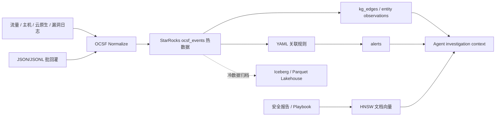

# SentinelGraph

一个开源的、面向大模型 Agent 的网络安全知识图谱与湖仓底座。它以 [OCSF](https://schema.ocsf.io/) 作为事件标准，以 [StarRocks](https://docs.starrocks.io/) 作为唯一的热数据、图关联和向量检索引擎，提供流批一体摄入、关联检测、告警和可审计的 Agent 调查上下文。

> 这是可运行的参考实现，而不是替代 SIEM/SOAR 的承诺。生产落地前应完成数据分类、租户隔离、RBAC、审计、规则调优与容量压测。

## 项目概览文档

运行服务后，面向产品、架构与安全团队的网页说明位于 <http://localhost:8000/guide>。它与本 README 对应相同的章节和边界：项目背景、OCSF、StarRocks 湖仓与事件中心图、检测、Vector/GraphRAG、文本补图、Mock/Live、REST API 及生产安全要求。README 保留部署、命令、SQL 与完整字段契约等可复制的工程细节；网页侧重概念与演示讲解。

## 为什么这样设计

- **OCSF first**：保留完整 `raw_event` JSON，同时将高频 OCSF 属性投影为列；供应商扩展不会破坏分析查询。
- **图不等于图数据库**：事件、用户、IP、资产、资源、云账号以“事件中心边表”落在 StarRocks。按时间、租户和入口实体裁剪邻域，避免全图扫描和全局节点热点写入。
- **流批一体**：`POST /v1/events` 适合实时网关；`sentinelgraph ingest` 适合 JSON/JSONL 回灌；Kafka Routine Load 与 Iceberg 冷层 SQL 模板也已提供。
- **Agent-ready GraphRAG**：图邻域、相关 OCSF 原始证据、检测告警和向量召回上下文由一个调查 API 返回。上层 LLM 只负责推理和叙述，不持有事实源。
- **Text-to-Graph enrichment**：安全报告、威胁情报和工单可先用离线规则抽取 IP、CVE、域名、URL、邮箱、哈希，再选择性由兼容 LLM 提议受限关系；所有文本关系默认 `pending_review`，保留来源、证据和置信度。
- **可演进的向量层**：文档向量与事件/实体并存在 StarRocks；默认使用 64 维确定性 demo embedding，生产中可替换 `EmbeddingProvider` 对接经治理的模型。



## 5 分钟启动

前提：Docker Compose，至少 4 GB Docker 内存。StarRocks 官方也提供 `starrocks/allin1-ubuntu` 用于本地快速启动。

```bash
docker compose up --build
curl http://localhost:8000/health
```

打开 API 文档：<http://localhost:8000/docs>。

打开客户演示控制台：<http://localhost:8000>。Mock 模式可选择三条客户可讲解的完整证据链：**互联网凭证攻击 → 异常外联 → 高危暴露**、**云账号接管 → 权限提升 → 对象存储访问**，以及 **终端入侵 → 横向移动 → 勒索影响**。每条链路会同时展示 OCSF 事件、关联告警、受限攻击图、MITRE 技术、业务影响、优先处置和待验证事项。完整讲解词见 [客户快速 Demo](docs/demo_runbook.md)。

首页的“连接外部集群”可对第三方 StarRocks 做一次不保存密码的只读握手测试。正式连接通过环境变量配置，支持 TLS/私有 CA；使用 [外部集群 Compose](docker-compose.external.yml) 时不会启动本地 StarRocks。完整部署步骤见 [接入第三方 StarRocks](docs/external_starrocks.md)。

演示台默认提供 **Mock 模式**：不要求 StarRocks、LLM 或网络，所有按钮都会返回完整的固定告警、图谱、历史行为簇和调查结果。切换为 Live 模式后可接入真实环境；LLM 配置与 GPT/Qwen 兼容方式见 [安全分析 LLM 配置](docs/llm_configuration.md)。

## 第三方 REST 集成

平台提供版本化的 `/v1` REST API。面向集成方的调用流程、curl 示例、边界约定及 OpenAPI 链接见 <http://localhost:8000/integrations>；运行中的交互式接口见 <http://localhost:8000/docs>，机器客户端可读取 <http://localhost:8000/openapi.json>。

设置逗号分隔的 `INTEGRATION_API_KEYS` 后，所有 `/v1` 调用必须携带 `X-API-Key`：

```bash
INTEGRATION_API_KEYS='partner-a-secret,partner-b-secret' docker compose up --build

curl http://localhost:8000/v1/integration/capabilities \
  -H 'X-API-Key: partner-a-secret'
```

密钥未配置时 API 保持开放，方便本地 Mock 和开发；这不是生产安全配置。生产环境还应在 HTTPS/API Gateway 后运行，结合 OIDC、租户授权、限流、IP 允许列表和审计。控制台的“调用凭据”仅临时存于当前浏览器页面，不会写入 Cookie、localStorage 或服务端。

API 也支持该模式：先通过 `GET /v1/demo/scenarios` 获取目录；在 `POST /v1/demo/load`、`POST /v1/agent/investigations` 的请求体传入 `"mode":"mock"` 和 `"scenario":"cloud_account_takeover"`，或为图谱/告警请求增加 `?mode=mock&scenario=cloud_account_takeover`。Mock 响应是确定性的，适合离线演示和前端联调；不会访问数据库或模型服务。

以下命令将示例日志摄入并运行规则。示例时间是固定值；如需命中窗口规则，请将其中 `time` 改为当前时间，或者摄入你的实时 OCSF 事件。

```bash
curl -X POST http://localhost:8000/v1/events \
  -H 'content-type: application/json' \
  --data @<(jq -s '{tenant_id:"demo", events:.}' examples/failed_authentication.jsonl)

curl -X POST 'http://localhost:8000/v1/detections/run?tenant_id=demo'
curl 'http://localhost:8000/v1/graph/user:u-alice?tenant_id=demo'
```

Docker 启动会自动创建表并尝试创建 HNSW 索引。若你的 StarRocks 集群不支持实验性向量索引，删除 Compose 中 bootstrap 命令的 `--vector-index` 参数，并将 API 的 `VECTOR_SEARCH_ENABLED=false`；图谱、流批与检测链路仍可独立运行。

## API

| Endpoint | Purpose |
| --- | --- |
| `POST /v1/events` | 批量接收原始 OCSF JSON，规范化后同时写入事件、实体观测和边。 |
| `POST /v1/ingest/{auto|ecs|cloudtrail|zeek|common_json}` | 接收常见 JSON 日志并映射为 OCSF；原始字段仍会保存。 |
| `POST /v1/demo/load` | 加载当前时间的完整攻击故事；仅在 `DEMO_ENABLED=true` 时开放。 |
| `GET /v1/demo/scenarios` | 返回离线 Mock 场景目录；可在无数据库、无模型环境下直接展示。 |
| `GET /v1/system/connection` | 返回当前运行连接的脱敏元数据和 TLS 状态。 |
| `POST /v1/system/connection/test` | 对填入的第三方 StarRocks 做一次只读握手，不保存密码。 |
| `GET /v1/system/llm` | 返回当前脱敏 LLM 配置和是否可用。 |
| `POST /v1/system/llm/test` | 对填入的 Chat Completions-compatible LLM 做一次临时连通性测试。 |
| `POST /v1/detections/run?tenant_id=…` | 执行安全 YAML 关联规则并以幂等 ID 创建告警。 |
| `GET /v1/alerts` | 查看当前租户告警。 |
| `GET /v1/graph/{entity_id}` | 读取 1–3 跳、大小受限且按时间排序的图邻域。 |
| `POST /v1/retrospective/analyses` | 对指定历史 OCSF 时间窗做共享实体/时间会话聚类，返回可解释的调查候选簇与 class 基线对比。 |
| `POST /v1/rag/documents` | 录入安全 playbook、处置记录或威胁情报文本。 |
| `POST /v1/text-graph/extract` | 将安全文本提取为可审核的 IOC 实体与关系；Live 模式可写入同一张图边表。 |
| `GET /v1/text-graph/extractions` | 查看文本抽取台账与待审核关系。 |
| `POST /v1/text-graph/extractions/{id}/review` | 追加人工审核决定；审核日志不可覆盖原始抽取证据。 |
| `POST /v1/agent/investigations` | 返回图、关联事件、语义上下文和 Agent 证据约束。 |

调查请求示例：

```bash
curl -X POST http://localhost:8000/v1/agent/investigations \
  -H 'content-type: application/json' \
  -d '{
    "tenant_id":"demo",
    "entity_id":"user:u-alice",
    "question":"该用户是否与异常外联和凭据攻击相关？",
    "depth":2
  }'
```

## 数据契约

`src/ocskg/ocsf.py` 是唯一的 OCSF 投影边界。下表是重点映射（并非替代完整 OCSF schema）：

| OCSF 属性 | StarRocks 列 | 图实体 |
| --- | --- | --- |
| `metadata.uid`, `time`, `class_uid`, `category_uid`, `type_uid` | `event_uid`, `event_time`, 对应 UID 列 | `event:{event_uid}` |
| `actor.user.uid/name` | `actor_user_uid/name` | `user:{uid}` |
| `src_endpoint.ip`, `dst_endpoint.ip/port` | `src_ip`, `dst_ip`, `dst_port` | `ip:{address}` |
| `device.uid/hostname` | `device_uid/hostname` | `asset:{uid}` |
| `resource.uid/name`, `cloud.account.uid` | 对应 resource/cloud 列 | `resource:*`, `cloud_account:*` |
| 未投影字段和任何扩展 | `raw_event JSON` | 可在扩展 normalizer 中产生边 |

OCSF 本身是供应商无关、存储无关的 schema framework；这里的列投影是为 StarRocks 查询与检测服务的实现选择，并不修改 OCSF 语义。[OCSF 项目说明](https://github.com/ocsf/)。

### 快速接入已有日志

除原生 OCSF 外，项目内置轻量 JSON 适配器，适合作为 POC 或接入的第一步：

| 来源 | 入口 | 重点映射 |
| --- | --- | --- |
| Elastic Common Schema | `POST /v1/ingest/ecs` / `sentinelgraph ingest --format ecs` | `@timestamp`、`event.*`、`user`、`source/destination`、`host` |
| AWS CloudTrail | `POST /v1/ingest/cloudtrail` | `eventTime`、`userIdentity`、`sourceIPAddress`、账号与 ConsoleLogin 结果 |
| Zeek conn 日志 JSON | `POST /v1/ingest/zeek` | `ts`、`id.orig_h/resp_h/resp_p`、`service/proto` |
| 传统 JSON | `POST /v1/ingest/common_json` | `timestamp`、`user`、`src_ip/dst_ip`、`hostname`、`message` |

示例：

```bash
curl -X POST http://localhost:8000/v1/ingest/ecs \
  -H 'content-type: application/json' \
  -d '{"tenant_id":"acme","events":[{
    "@timestamp":"2026-08-10T09:00:00Z",
    "event":{"id":"ecs-1","category":"authentication","outcome":"failure"},
    "user":{"name":"alice"}, "source":{"ip":"203.0.113.42"},
    "host":{"name":"web-01"}, "message":"login denied"
  }]}'
```

适配器旨在降低首日接入成本，并会保留所有源记录；生产场景请按数据源的正式 OCSF profile 在 Flink、Kafka Connect 或采集器侧补齐映射、字段质量和敏感数据治理。

## 检测与图推理

规则位于 [`rules/default.yaml`](rules/default.yaml)，声明时间窗口、分组键、阈值和受白名单保护的谓词。当前支持 `eq`、`gte`、`in` 以及仅对 `message` 开放的 `contains`。规则编译为带租户、时间下界和 `LIMIT` 的 StarRocks 聚合 SQL，避免把任意 SQL 暴露给 API 调用者。

图查询从一个实体出发，逐跳查询 `kg_edges`，每跳都受 `LIMIT` 约束；随后只回表这些节点的观测数据。这使横向移动、账号—主机—IP 关联可用，而无需对百亿级边执行无界递归。

## 历史数据聚类与事后分析

`POST /v1/retrospective/analyses` 面向已入库的 OCSF 历史事件：StarRocks 先按 `tenant_id + event_date + event_time` 进行分区裁剪和有界读取，随后服务端只在受 `max_events` 限制的结果中，将同一时间间隔内共享用户、IP、资产、资源、云账号或 trace 的事件归为行为簇。它适合复盘、威胁狩猎和告警后的范围评估，而不取代实时检测。

每个候选簇返回风险优先级、时间范围、共有实体、跨 OCSF 类别信号、可回溯 `event_uid`、建议核验项，以及分析窗口前的 class-level 基线对比。风险分数是透明的排序信号，不是攻击概率；共享 IP、资产或时间邻近都不能单独证明入侵或归因。

```bash
curl -X POST http://localhost:8000/v1/retrospective/analyses \
  -H 'content-type: application/json' \
  -d '{
    "tenant_id":"acme",
    "lookback_hours":168,
    "baseline_hours":720,
    "session_gap_minutes":30,
    "max_events":20000,
    "cluster_limit":12
  }'
```

默认分析最近 7 天，并用开始时间前 30 天的 OCSF `class_uid` 分布辅助解释“未见/低频事件类别”。可显式给出 `start_time` 和 `end_time`（ISO-8601）；单次范围最多 90 天、基线最多 365 天、读取最多 50,000 条事件。对更长历史建议按日期分区离线批处理，并将结果接入工单或案例管理流程。Mock 模式同样支持该接口，返回当前演示场景的确定性历史证据切片，不连接数据库或 LLM。

## 向量检索与 GraphRAG

StarRocks 的 HNSW 向量索引是 Beta 能力，官方文档要求 shared-nothing 集群 **v3.4+**，并先设置 `enable_experimental_vector=true`。本项目初始化时设置该开关；`sql/vector_index.sql` 使用余弦相似度、归一化向量和 HNSW。查询满足 `approx_cosine_similarity(embedding, constant_array) DESC LIMIT N` 的 ANNS 形态，并使用 `efsearch=128` 提示。[StarRocks Vector Index 文档](https://docs.starrocks.io/docs/table_design/indexes/vector_index/)

GraphRAG 部分借鉴“图结构作为 LLM 检索上下文”的方法：`/v1/agent/investigations` 把事实边、原始 OCSF 事件和相似安全文档一起返回，但不会自行声称攻击已经成立。微软的 [GraphRAG](https://github.com/microsoft/graphrag) 同样将其定义为从非结构化文本抽取结构化数据的数据管道；若接入外部 LLM，应将其输出作为待验证的推理层。

### 从文本补充图谱

页面的“解析报告为图关系”可直接展示此流程。规则模式不需要模型服务，识别 IP、CVE、域名、URL、邮箱与 SHA-256，并生成两种边：`document → mentions → IOC` 是可复现的直接指标；`co_mentioned_in_sentence` 只是同句上下文，置信度较低，**不能**解释为通信或归因。

```bash
curl -X POST http://localhost:8000/v1/text-graph/extract \
  -H 'content-type: application/json' \
  -d '{
    "tenant_id":"acme",
    "source_id":"case-2026-0810",
    "source_type":"incident_report",
    "content":"web-01.prod.demo connected to 198.51.100.9 after CVE-2025-9999.",
    "extractor":"rules",
    "persist":true
  }'
```

`extractor:"llm"` 需要已配置的 `LLM_*`。服务端先用规则确定候选实体，再要求模型仅在这些实体间从白名单关系（如 `communicates_with`、`affects`）中提出建议；无原文证据、未知实体或未允许关系会被丢弃。所有结果均以 `pending_review` 写入 `text_graph_extractions`，人工审核作为追加日志写入 `text_graph_reviews`。

新部署会自动创建这两张表。已有库请在替换数据库名后执行 [0002_text_graph.sql](sql/migrations/0002_text_graph.sql)。

## 批处理、Kafka 与 Lakehouse

```bash
# 本地 Python（先 cp .env.example .env 并确保 StarRocks 已启动）
python -m venv .venv && source .venv/bin/activate
pip install -e '.[dev]'
sentinelgraph bootstrap --vector-index
sentinelgraph ingest examples/failed_authentication.jsonl --tenant demo
sentinelgraph detect --tenant demo
```

- [`sql/kafka_routine_load.sql`](sql/kafka_routine_load.sql)：生产 Kafka 入口模板。建议由 Flink/Kafka Connect 先做 OCSF 规范化，避免在数据库里承担复杂 JSON 转换。
- [`sql/iceberg_catalog.sql`](sql/iceberg_catalog.sql)：Iceberg REST catalog 冷层模板。归档作业写 OCSF Parquet，StarRocks 可与热表联查。
- 热表按 `event_date` 动态分区，默认保留窗口为过去 30 天到未来 3 天；生产环境请按容量策略改分区、bucket、复制数与归档周期。

## 安全与生产化清单

- 在网关做 OIDC/mTLS、租户身份映射和速率限制；示例 API 为内网开发用途，**没有认证**。
- 第三方 StarRocks 使用环境变量或 Secret 注入；页面连接测试不保存凭据，正式环境仍须经 HTTPS、RBAC 与审计网关保护。
- LLM Key 仅从服务端 Secret/环境变量读取；Mock 模式不会发送模型请求。真实模型输出是证据辅助，不可替代检测规则和人工研判。
- StarRocks 账号使用最小权限；生产集群将 SQL 表里的 `replication_num=1` 改为适合副本数的值。
- 加密对象存储、备份、传输和敏感字段；将 IP、用户名、原始日志访问纳入审计。
- 把 `HashEmbeddingProvider` 替换为受版本控制且已评测的 embedding 模型；向量相似度不能作为告警或归因的唯一证据。
- 为高吞吐入口接入 Kafka Routine Load / Stream Load，按租户或时间调整分桶；压测真实事件大小、基数和查询并发后再设置 HNSW 参数。

## 开发与验证

```bash
pip install -e '.[dev]'
ruff check .
pytest -q
docker compose config
```

贡献请保持 OCSF 兼容性：新增源类型优先扩展 normalizer 和测试；新增检测优先用 YAML 规则而不是把租户特定 SQL 写进 API。

## License

Apache-2.0. OCSF 和 GraphRAG 是独立项目及其各自许可；本仓库不包含它们的代码或 schema 文件。
